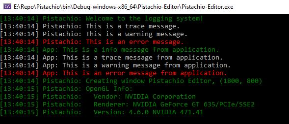
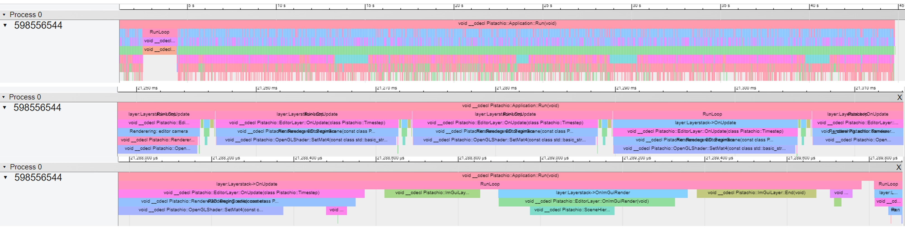
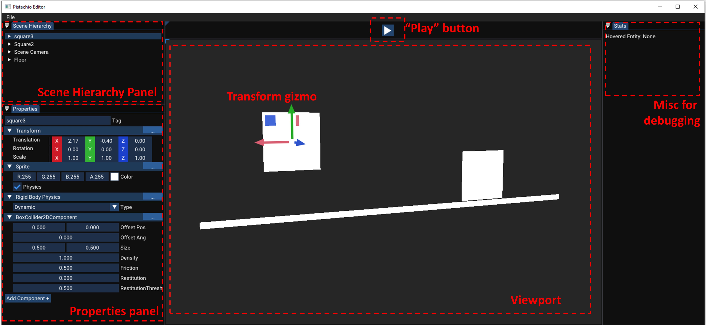
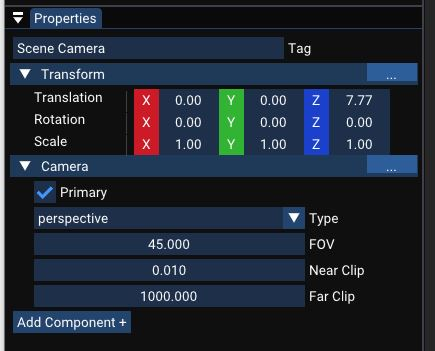
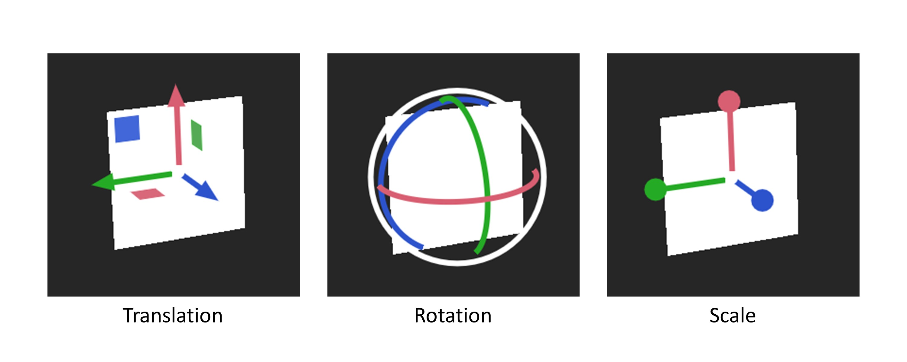

# Pistachio
Pistachio Engine is self-learning project based on [the Hazel Engine by the Cherno](https://github.com/thecherno/hazel). It focuses on game engine architecture in various aspects including core, input, UI, rendering, physics, and entity component system (ECS).

## Overview
Placeholder gif

## Main features
1. **Core**: logging system (spdlog), math (glm), assert system, event system/event dispatcher, layerstacks, input polling, profiling, serialization
2. **Renderer** (OpenGL): shaders (GLSL), vertex array, textures, orthographic/perspective camera, batch rendering, framebuffer
3. **Editor UI** (ImGui): viewport, scene hierarchy panel, properties panel, transform gizmos (ImGuizmo), editor/scene camera, mouse picking
4. **Physics** (Box2D): runtime simulation
4. **Entity component system** (Entt)

## Core
### Logging system
The logging system is intended to be used for debugging purpose by logging information to console. [Spdlog](https://github.com/gabime/spdlog) is used for its fast performance and convenient color coding. The logging system supports different levels of messages being logged, as well as whether this message comes from the engine or the application.



### Assert system
Assert system is used conveniently asserting if a specific condition is true, and logging corresponding information if not. It is only used for developing and should be disabled in release and distribution.
```C++
#ifdef PTC_ENABLE_ASSERTS
    #define PTC_ASSERT(x, ...) {if(!(x)) {PTC_ERROR("Assertion Failed: {0}", __VA_ARGS__); __debugbreak();}}
    #define PTC_CORE_ASSERT(x, ...) {if(!(x)) {PTC_CORE_ERROR("Assertion Failed: {0}", __VA_ARGS__); __debugbreak();}}
#else
    #define PTC_ASSERT(x, ...)
    #define PTC_CORE_ASSERT(x, ...)
#endif
```

### Event system
Any event (mouse, keyboard, window event, etc.) in the application window is propergated to each layer by callback functions and handled there. In each layer, events are dispatched depending on event type. The event will kept being dispatched until it is marked as handled by any layer.

### Profiling
A simple profiler is achieved by an instrumentation timer and information was logged to .json file. Below shows the profiling of a session on different time scales. The code was attributed to [this file](https://gist.github.com/TheCherno/31f135eea6ee729ab5f26a6908eb3a5e).



### Serialization
Once we started to work with a scene, a proper serialization/deserialization of the scene data is needed. In this project, we used [YAML](https://yaml.org/) for data serialization. The user is able to save a scene by "Ctrl + S", and open a saved scene by "Ctrl + O".

## Renderer
This project is *not* a rendering technique showcase, so all rendering components are kept to minumum, a.k.a no various primitive shapes and material system is implemented for now. However, the rendering pipeline and its abstractions are written in mind of possible rendering API extension. The API-specific code are properly wrapped.

### Shaders and shader library
In this project, the shaders are the most basic flat coloring shaders written in GLSL. The vertext shader and fragment shader are ketp to minimum to pass in position, color, texture coordinates, entity ID (used for ECS), and camera view projection matrix. A simple shader library (unordered map) is used to keep track of available loaded compiled shaders.

### Orthographic/perspective camera
The orthographic and perspective cameras are initially implemented with the rendered but later impplmented as the scene/editor camera. 

An editor camera comes with the editor, to be used in editor mode. A scene camera is an element of the camera component, if an entity in a scene has it. A scene camera is used for runtime. If a scene doesn't have a primary scene camera, then editor camera is used for runtime.

### Batch rendering
Batch rendering are intended to reduce the number of draw calls in each frame. The vertex/index buffer are filled until the the flush command is called at the end of each frame.

### Framebuffer
To render the scene into a docking panel in our editor (a.k.a the viewport), we need to first render everything into a framebuffer. 

## Editor
The editor UI is designed similar to that of mainstream game engines by using [ImGui](https://github.com/ocornut/imgui). In this project, the editor currently has a viewport, a scene hierarchy panel, and a properties panel.



### Viewport
The viewport is achieved by integrating a framebuffer, so it can be docked anywhere in the editor window. The viewport displays rendering result in both editor and runtime mode. The viewport allows manipulation of editor camera by using Left Alt and mouse buttons (left for rotation, middle for panning, scroll for scaling). The user can select entities by mouse clicking from the viewport.

### Scene hierarchy panel
This is the panel to show a list of entities currently we have in a scene. The hierarchy of the entities are currently not implemented so there is only 1 level for the entire scene. The user can add a new entity to the scene from the prompted menu by right clicking the empty space. By clicking the name of the entities, the components of the entity is displayed in the properties panel.

### Properties panel
This panel displays the detailed information about the component of the currently selected entity. The user can rename the entity by editing the tag. The user can change the property value by dragging or typing the value, or by selecting properties from a drop down menu. New components can also be added by clicking "Add Component +" button. Existing components can be removed from the entity by clicking "..." button on the right. All changes should be reflected immediately in the viewport.



### Transform gizmos
Transform gizmos are achieved by using [ImGuizmo](https://github.com/CedricGuillemet/ImGuizmo). Like every 3D creative software, the user is able to freely change the transform (translation, rotation, scale) of a selected object by an easy-to-use gizmo, so should they be able to in Pistachio! When selecting an entity, use "W", "Q", or "E" to invode translation, rotation, and scale, respectively. The change in the transform will be immediately reflected in the viewport, as well as the properties panel.



### Mouse picking
To realize mouse picking object in the viewport, the entity ID was also delivered to the shader. The corresponding entity ID of the pixel where the cursor is at is read from the framebuffer. The pixel value is then used to retrieve the hovered entity. Clicking left mouse, the hovered entity will be selected. Clicking in empty space will deselect any entity from the viewport and the properties panel. The mouse clicking is active only when not in camera manipulation mode, not in runtime simulation, or not on transform gizmo of another entity.


## Physics (Box2D)
We use [Box2D](https://github.com/erincatto/box2d) to simulate physics at runtime. To execute runtime simulation, use the "scene play" button above the vviewport. During runtime simulation, entities with a "primary" camera component will be used for rendering, if no such entity exists, the editor camera will used for rendering. In simulation mode, clicking stop button will end simualtion, and the scene data from before the simualtion will be restored.

placeholder gif

## Entity component system (Entt)
Under the hood, the entity component system is used to manage the data in the scene.

